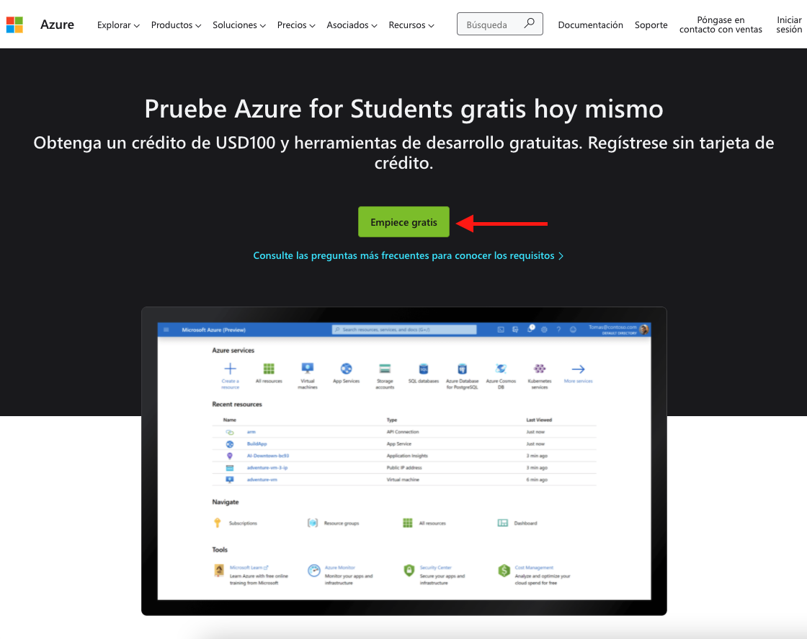
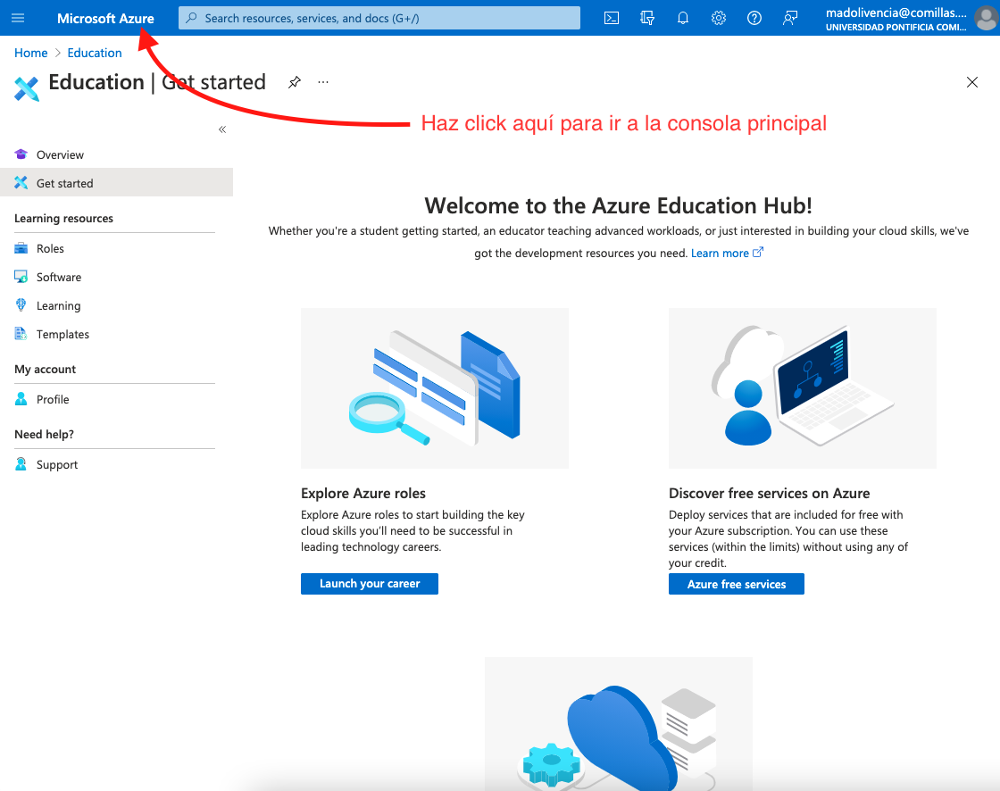
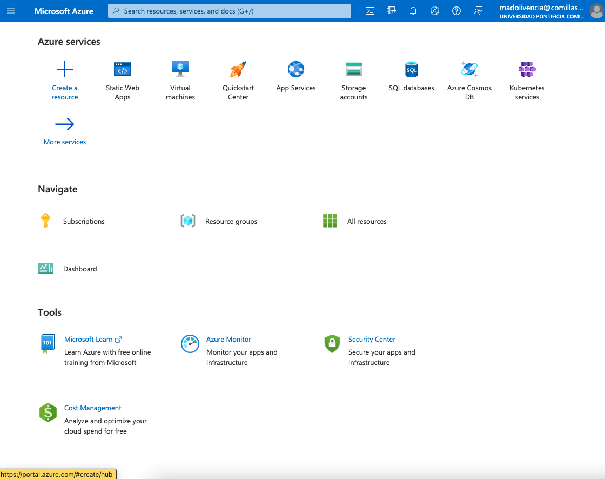
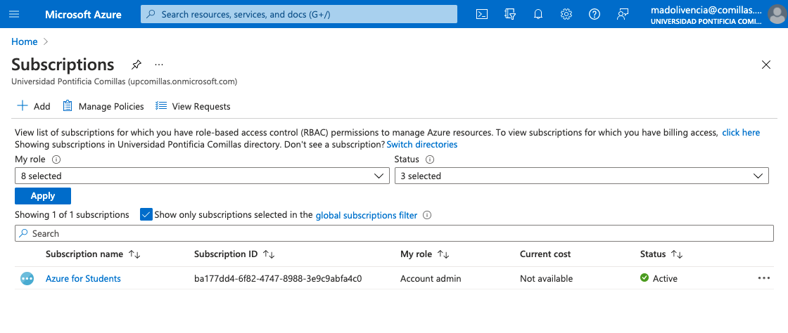
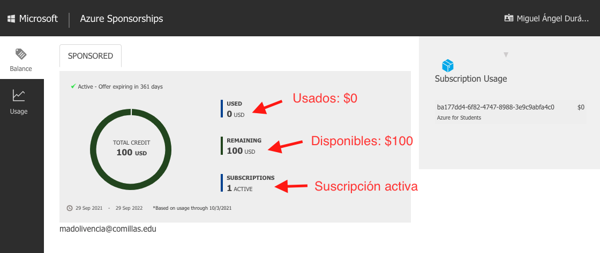
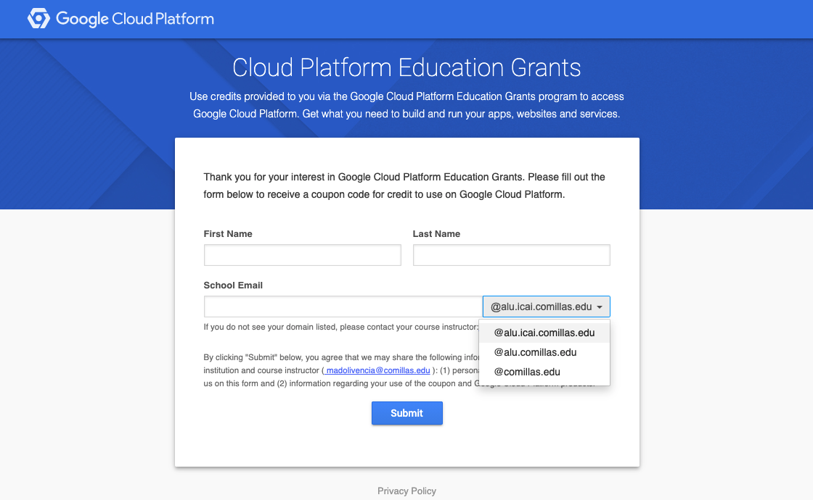
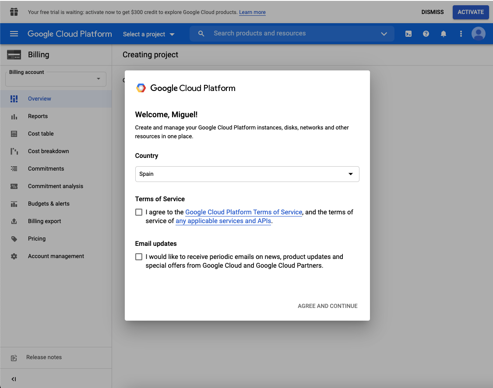
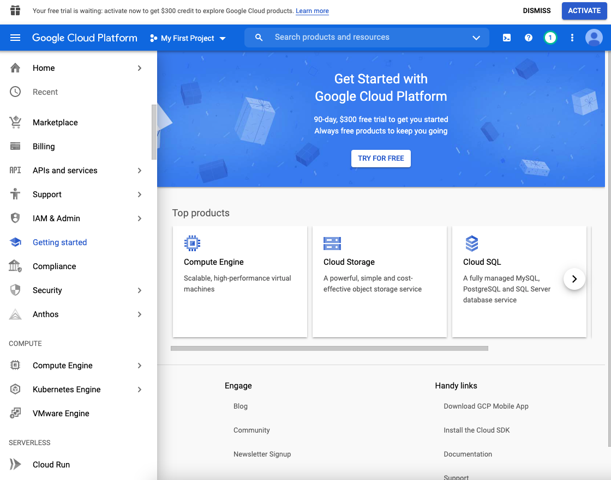
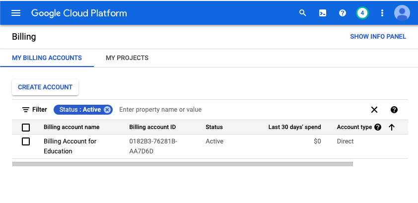

## Activación de cuenta en Google y Azure

Antes de comenzar con la gestión y operación de una plataforma cloud vamos a ver como activar nuestra cuenta en GCP y Azure, para así tener nuestro *free trial*. 

###### Activando Azure

Empezaremos con Microsoft Azure. En este caso, lo único que tenemos que hacer es solicitar nuestros créditos gratuitos para estudiantes en el siguiente [link](https://azure.microsoft.com/es-es/free/students/), y proceder con la autenticación mediante la cuenta de estudiante de la universidad:

Al terminar todo el proceso de autenticación y verificación, se llega a la siguiente *landing page*:

Tras hacer click en la barra de navegación en "Microsoft Azure" llegamos a la consola principal:

Para comprobar que tenemos activa nuestra subscripción como estudiantes, solo tenemos que hacer click en el icono de **Subscriptions** que aparece bajo la sección **Navigate**, y veremos:

Si lo que queremos es directamente comprobar cuantos créditos nos quedan disponibles, podemos ir directamente al siguiente destino: https://www.microsoftazuresponsorships.com/Balance, lo que nos debería mostrar algo como lo siguiente:

###### Activando GCP

Para la activación de la suscripción de estudiante (que viene con unos créditos gratuitos al igual que en el caso de Azure), necesitamos que el responsable del curso comparta con nosotros el "cupón" correspondiente. 

Cuando hagamos click en susodicho link, nos llevará a una pantalla de autenticación y login:

Aquí tendremos que seleccionar el dominio correcto de nuestro email (como se ve en el desplegable de la imagen) y rellenar los datos correspondientes al Nombre, Apellidos y la dirección de correos.

Una vez terminado el proceso de autenticación, deberíamos llegar a una *landing page* como la siguiente:

Aquí tendremos que marcar la opción de **Acuerdo con los términos de servicios CGP**, no tenemos porqué marcar la casilla de **Email Updates** (de hecho se recomienda no hacerlo para evitar emails comerciales en vuestra bandeja de entrada).

Una vez se confirma el acuerdo, llevará unos segundos, en los cuales GCP está creando un proyecto en blanco para nuestro uso, y finalmente llegaremos a la consola:

Para saber que nuestra cuenta está activada y tenemos correctamente configurada la cuenta de prueba, podemos acceder al siguiente link: https://console.cloud.google.com/billing:

