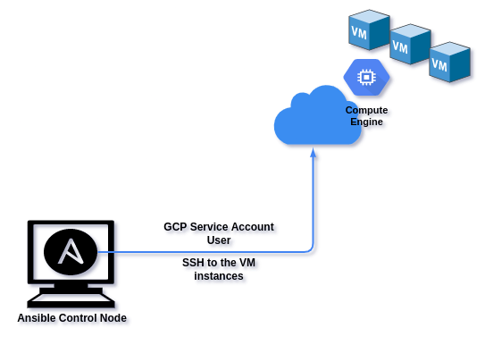
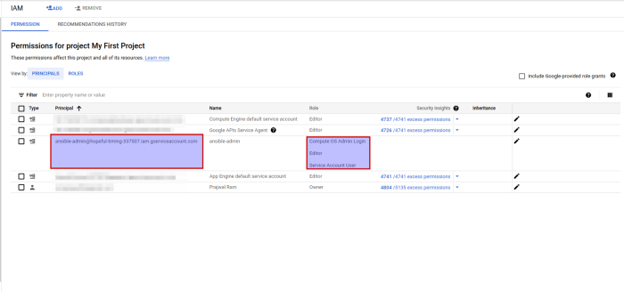
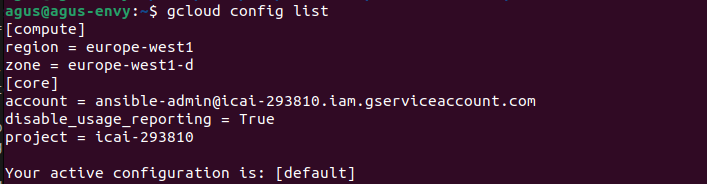
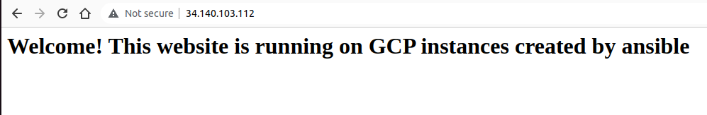

## Introducción
Ansible es una herramienta utilizada principalmente para el aprovisionamiento y la gestión de la configuración. Con la ayuda de los módulos de GCP en Ansible, podemos realizar las tareas en GCP usando Ansible.

En esta práctica vamos a realizar el aprovisionamiento de la instancia de Google VM Compute en GCP y alojamiento de un sitio web (apache) en esta instancia creada. 

## Diseño



## 1. Creación Service Account y descargue las claves (.json)
Es necesario crear una Service Account en GCP y darle permisos, para que posteriormente esta sea usada por Ansible para realizar los despliegues y configuraciones.
Las Service Account se utilizan para la autenticación entre software - software (aplicación - aplicación). En nuestro caso (GCP — Ansible)
Habrá que seguir la regla del mínimo privilegio, por lo que se darán estos permisos:


#### Dar el nombre y los permisos a la Service Account



```
name = ansible-admin
Roles= Compute OS Admin Login, Compute Admin, Service Account user
```
#### Descargar las claves (archivo .json)

Después de crear la SA, descarga una key en local, ya que usaremos este fichero que contiene la key más adelante.

```
Create new key -> Download JSON file
```

## 2. Asociar una clave SSH a la SA que hemos creado

```bash 
# login with normal user
gcloud init 
# Se añade un metadato que indica que todas las máquinas del proyecto son accesibles por OS-LOGIN
gcloud compute project-info add-metadata --metadata enable-oslogin=TRUE 

# Ahora nos vamos a autenticar en nombre de la SA que hemos creado antes
gcloud auth activate-service-account --key-file=<fichero .json descargado antes>

# Generamos unas claves ssh específicas para esta SA, y se las vamos a asignar a la service account
ssh-keygen -f ~/.ssh/ssh-key-ansible-sa
gcloud compute os-login ssh-keys add --key-file=ssh-key-ansible-sa.pub

# Checkear que todo anda bien
gcloud config list

# Setear la región y zona por defecto
gcloud compute project-info add-metadata --metadata google-compute-default-region=europe-west1,google-compute-default-zone=europe-west1-b

# Confirmar que todo está correctamente configurado
gcloud config get-value compute/region
gcloud config get-value compute/zone
gcloud compute project-info describe | yq '.commonInstanceMetadata.items[] | select (.key == "enable-oslogin")'

```




## 3. Revisión de la plantilla que vamos a lanzar

inicio de gcloud
Estructura del directorio del proyecto
```shell
$ tree
.
├── main.yml
└── roles
    └── simple-web
        ├── files
        │   └── index.html
        └── tasks
            └── main.yml

4 directories, 3 file
```


Código para el playbook de Ansible

main.yml: este archivo es el playbook principal. La mayoría de las cosas se explican por sí mismas.
```yaml
# ansible notebook, to configure the VMs on GCP
- name: Create Compute Engine instances
  hosts: localhost
  gather_facts: no
  vars:
      gcp_project: icai-293810 #Setear vuestro proyecto
      gcp_cred_kind: serviceaccount
      gcp_cred_file: "/home/....../icai-293810-1ebd82e69568.json" #Aqui setear con la ruta de vuestra SA
      region: "europe-west1"
      zone: "europe-west1-d"
      machine_type: "n1-standard-1"
      image: "projects/centos-cloud/global/images/centos-7-v20230912"

  tasks:
   - name: Create private IP address to the VM instance
     gcp_compute_address:
       name: "maquina-prueba-ip"
       region: "{{ region }}"
       project: "{{ gcp_project }}"
       service_account_file: "{{ gcp_cred_file }}"
       auth_kind: "{{ gcp_cred_kind }}"
     register: gce_ip
   - name: Bring up the instance in the zone
     gcp_compute_instance:
       name: "maquina-prueba"
       machine_type: "{{ machine_type }}"
       disks:
         - auto_delete: true
           boot: true
           initialize_params:
             source_image: "{{ image }}"
       network_interfaces:
         - access_configs:
             - name: External NAT  # public IP
               nat_ip: "{{ gce_ip }}"
               type: ONE_TO_ONE_NAT
       tags:
         items: 
           - http-server
           - https-server
           - ssh-externo

       zone: "{{ zone }}"
       project: "{{ gcp_project }}"
       service_account_file: "{{ gcp_cred_file }}"
       auth_kind: "{{ gcp_cred_kind }}"
     register: gce 

  post_tasks:
    - name: Save host data
      add_host:
        hostname: "{{ gce_ip.address }}"
        groups: gce_instances_ips

- name: Deploy httpd and custom html page 
  hosts: gce_instances_ips
  become: yes   # to run as root
  become_method: sudo
  roles:
    - simple-web
```

Hasta la línea 12, Play-1: Estamos asignando valores a las claves, que se utilizarán en los próximos bloques: 
- project ID
- gcp_cred_file: es la key que descargamos asociada a la SA, estamos usando este archivo para la autenticación. 
- image: SO que usaremos. Para otros sistemas operativos, busque "images" en la consola de GCP, en Compute Engine -> "images".

Línea 15–22, Tarea 1: para crear una IP privada para la VM usando el módulo ansible "gcp_compute_address", línea 22 "registrar: gce_ip" significa que estamos nombrando una variable "gce_ip" para todo el bloque, es decir, para Tarea-1, más tarde podemos usar para abordar todo este bloque.

Línea 23–36, Tarea 2: estamos creando la instancia de VM, agregando discos y obteniendo una dirección IP pública para la VM

Línea 37–45: estamos agregando network tags, básicamente para que el firewall de GCP permita el tráfico HTTP y HTTPS, ya que necesitamos acceder al sitio web mediante HTTP.

Línea 47–51: este bloque es una sección posterior a las tareas, estamos agregando un delay hasta que el servicio ssh se inicialice en la máquina virtual.

Línea 53–58, Play-2: Estamos instalando httpd en la VM y copiando nuestro(s) archivo(s) HTML a la VM. Para lograr esto, tenemos un concepto de "roles" en Ansible, a cada rol se le pueden asignar algunas tareas específicas para realizar. Aquí el rol es “simple-web”. Crea un directorio llamado "roles/simple-web/tasks" para otro playbook y "roles/simple-web/files" para todos los archivos HTML, CSS, JS, etc.

roles/simple-web/tasks/main.yml: este es otro playbook para instalar httpd en VM y alojar nuestro sitio web en la VM.

```yaml
---
# Ansible playbook to install httpd, copy html files and start httpd server
- name: Install apache on instances
  yum: name=httpd update_cache=yes state=present 

- name: Copy my index html to instances 
  copy: src=index.html dest=/var/www/html/index.html

- name: Keep the apache service started
  service: 
    name: httpd 
    state: started

```


Línea 4: "yum" es un módulo Ansible para sistemas basados en RHEL/CentOS, consulta la documentación de Ansible para otros sistemas operativos. Se ha usado "yum" porque el sistema operativo elegido ha sido RHEL. En esta línea, estamos instalando el paquete “httpd”. si "state = present" para instalar el paquete

Línea 8: Copiando los archivos de nuestro sitio web a VM

Línea 10–13: Iniciar el servicio httpd en la VM

roles/simple-web/files/index.html : archivo del sitio web
```html
<html>
    <head>
        <title> Ansible on GCP </title>
    </head>
<body>
    <h1> Welcome! This website is running on GCP instances created by ansible </h1>
</body>
</html>
```


## 4. Ejecutando el Ansible
El paso final para resumir todo el código es ejecutar el playbook de ansible.
```shell
$ ansible-playbook main.yml -u sa_<UID de la SA>

### Si anterior comando te falla, puede que haga falta instalar algunas librerías de python que usa ansible en esta plantilla
python3 -m pip install --upgrade google-auth 

### Si lo anterior falla, también puede ser porque es necesario confiar en los host automáticamente. Para ello es necesario modificar el fichero /etc/ansible/ansible.cfg y añadir lo siguiente
[defaults]
host_key_checking = False

```
Para el UID de la SA -> Consola de GCP -> IAM -> Service Accounts -> Haga clic en la SA que creó y ahí tiene que aparecer el id de la SA.
También se puede abrir el fichero de texto y vendrá ahí.


## ENTREGA: subir a git la plantilla/s modificada. 
¿Por qué está fallando? ¿Qué cambios habría que hacer? Modifica la plantilla de Ansible para añadir los componentes que falta.
Las preguntas son retóricas, vuestro profesor para corregir esta plantilla se va a descargar vuestra entrega que hagáis en moodle. En ella tendrá que existir la estructura de carpetas que habéis preparado metido todo en una carpeta "ansible". Para la validación lanzará algo de este estilo sobre un proyecto ya creado donde se habrá activado el os-login y se habrá creado una serviceaccount.
```shell
#!/bin/bash
gcp_project=proyectoXXXXXXX
gcloud config set project $gcp_project
gcloud config set account a****a@g****.com
##BORRANDO CUALQUIER MÁQUINA O REGLA DE FIREWALL PREVIA (PARA NO PISAR LO DE OTRO ALUMNO ANTERIOR)
gcloud compute instances list | grep RUNNING | awk '{printf "gcloud compute instances delete %s --zone %s --quiet\n", $1, $2}' | bash
gcloud compute firewall-rules list | grep -v "NAME" | awk '{printf "gcloud compute firewall-rules delete %s --quiet\n",$1}' | bash


###LANZANDO EL ANSIBLE PLAYBOOK
ansible-playbook main.yml -e "gcp_project=$gcp_project gcp_cred_file='/full/path/sa.json' zone='europe-west1-d'" -u "sa_$(jq -r .client_id /full/path/sa.json)" --key-file /full/path/.ssh/ssh-key-ansible-sa"


curl $(gcloud compute instances describe maquina-prueba \
  --format='get(networkInterfaces[0].accessConfigs[0].natIP)')


```
## Resultado
Al abrir la IP pública de la VM desde la consola de GCP, vemos que nuestro sitio web está implementado en la VM.
Sitio web en ejecución de instancias de VM de GCP, implementado con Ansible


