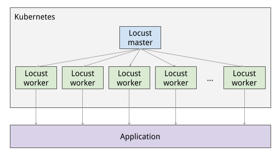

## ENTREGA 3

Vamos a montar un cluster de LOCUST para lanzar pruebas de rendimiento. Vamos a tomar de referencia el laboratorio de la certificación de Cloud de Google para ello:
https://www.cloudskillsboost.google/focuses/967?locale=en&parent=catalog

Para montar LOCUST he dejado un zip con todo lo necesario, así como las instrucciones en inglés que serán necesarias para montar nuestro cluster. Está formado principalmente por dos pasos:
1. Crear una imagen docker con Locust y un escenario de pruebas básico que va con el path "/" del hostname que se indique

2. Montar dos deployments, uno para el pod de master (que es el servidor web y orquestador) y otro para los pods de slave que son los que lanzan las pruebas

# ENTREGA
Será necesario entregar:
- Los yamls adaptados para desplegar LOCUST en vuestro cluster.
- Entregar pdf que incluya los pantallazos que haya producido la ejecución de LOCUST probando distintos escenarios: replicas del servidor php, hpa, cambiando tamaño de nodos etc